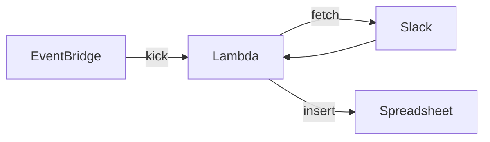

# kakeibo

Slack の特定チャンネルに送信されたメッセージを Spreadsheet に転記するもの

以下を定期実行する

1. Slack API を利用して Slack メッセージを取得する
2. 特定期間に投稿されたメッセージのみに絞る
3. gspread を利用して Google Sheet に行を追加する



## Develop

### Run

```shell
$ cp .env.example .env
$ make run
```

### Lint

```shell
$ make lint
```

### Test

```shell
$ make test
```

## Build Docker 

```shell
$ make docker-build
```
