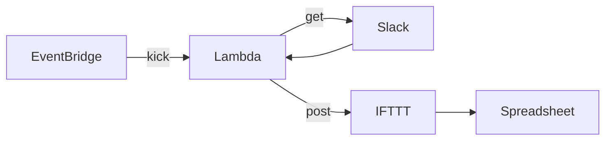

# kakeibo

Slack の特定チャンネルに送信されたメッセージを Spreadsheet に転記するもの

以下を定期実行する

1. Slack API を利用して Slack メッセージを取得する
2. 特定期間に投稿されたメッセージのみに絞る
3. IFTTT の Webhook URL を利用して Google Sheet に行を追加する



## Execute

```
$ cp .env.example .env
$ python src/main.py
```

### Test

```
$ pytest src
```

### Mypy

```
$ mypy src
```

## Lambda

AWS Lambda で定期実行するためには requests ライブラリを含んだ Layer を作成する

Linux 開発マシンを使用してこれらのライブラリをコンパイルしてビルドし、バイナリを Amazon Linux と互換性を持たせる必要がある（[ref.](https://docs.aws.amazon.com/ja_jp/lambda/latest/dg/configuration-layers.html)）

```
$ ./scripts/clean_caches.sh 
$ mkdir python
$ pip install -t python requests
$ zip -r9 layer.zip python
$ rm -r python
```
